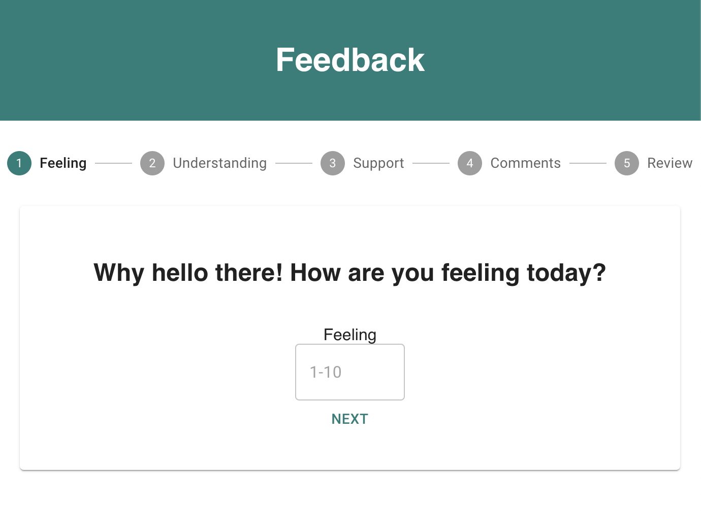
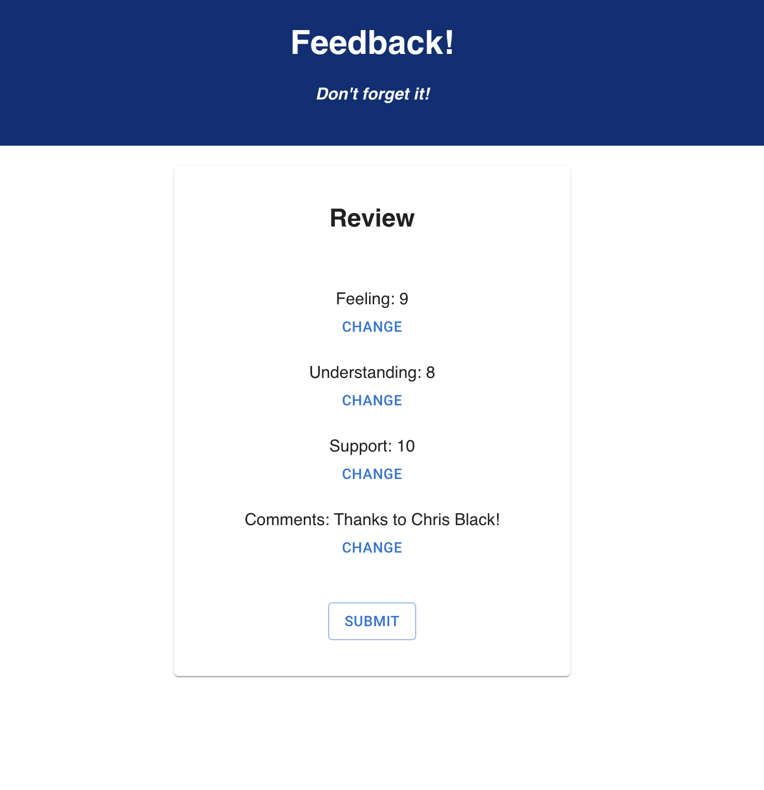
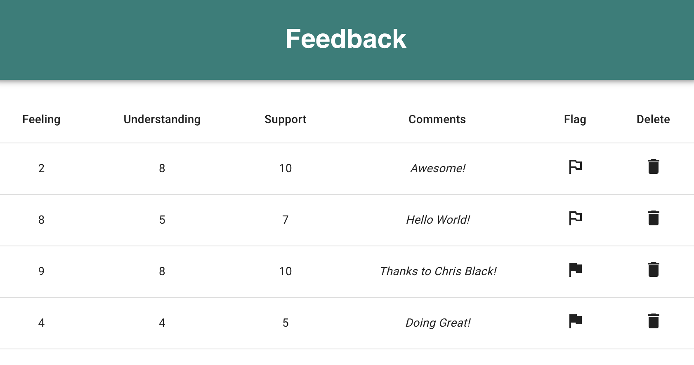

# Redux Feedback Loop

## Description

Duration: Multiple days of work over a 2 week period

This project contains a 4-step feedback survey for the user to fill out. The survey asks how the user is feeling, how well they are understanding the content, and how well they are being supported. After answering these questions, the user can leave a comment and review their answers before submitting to a database.

## Preview

  

  

## Installation / Setup

1. Clone down this repository. You will need node and npm installed globally on your machine.
2. Create a database with the name `prime_feedback`
3. Create a table using the instructions in `data.sql`
4. In your editor of choice, run `npm install` in your terminal 
5. Run `npm run server` in your terminal
6. In a new terminal window, run `npm run client`

## Usage

The user can answer each of the 3 questions by inputting a number between 1 and 10 and clicking the next button to go to the next question. If a number is entered that is not between 1 and 10, the user will receive an alert and will not be able to proceed. After the first 3 questions, the user can leave a comment (not required to proceed) and then review their answers before submitting them to a database by clicking the `Submit` button. Users can click any of the `change` buttons on the review page to go back to a previous step and change their answer. After submission, the user can click the `Leave New Feedback` button to be returned to the beginning of the survey.

The information stored in the database is displayed in a table at the route `/admin`. Each feedback entry gets displayed along with a `Flag` and a `Delete` button. The flag button can be clicked to change flagged from false to true in the database for that entry. The delete button can be clicked to remove a feedback entry from the database and it will no longer be displayed in the table.

## Built With

- Javascript
- React
- Redux
- Axios
- MaterialUI
- PostgreSQL

## Acknowledgement

Thanks to Chris Black and Prime Digital Academy for providing me with the knowledge I needed to make this!

## Support

If you run into any issues or have suggestions, please email me at erichjohnengler@gmail.com

Thanks for viewing!
