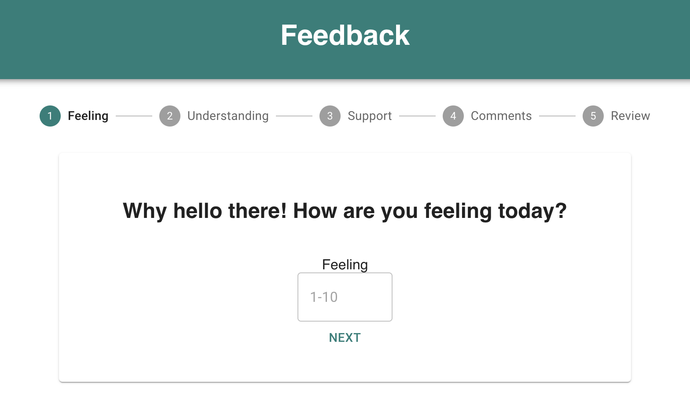
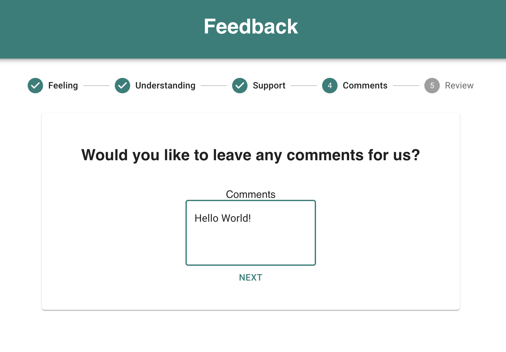

# Redux Feedback Loop

## Description

Duration: Multiple days of work over a 2 week period

This project contains a feedback survey for the user to fill out. The survey asks how the user is feeling, how well they are understanding the content, and how well they are being supported. Each of these 3 questions can be answered by inputting a number between 1 and 10 and clicking the next button to go to the next question. If a number is entered that is not between 1 and 10, the user will receive an alert and will not be able to proceed to the next question. After the first 3 questions, the user will be able to leave a comment and then review their answers before submitting them to a database by clicking the `Submit` button. Users can click any of the `change` buttons on the review page to go back to a previous step and change their answer. After submission, the user can click the `Leave New Feedback` button to be returned to the beginning of the survey.

The information stored in the database is displayed in a table at the route `/admin`. Each feedback entry gets displayed along with a `Flag` and a `Delete` button. The flag button can be clicked to change flagged from false to true in the database for that entry. The delete button can be clicked to remove a feedback entry from the database and it will no longer be displayed in the table.

## Screenshots

  

  

## Installation

1. Create a database named `prime_feedback`
2. Create a table using the instructions in `data.sql`
3. Run `npm install` in your terminal
4. Run `npm run server` in your terminal
5. In a new terminal window, run `npm run client`

## Built With

1. Javascript
2. React
3. Redux
4. MaterialUI
5. PostgreSQL

## Acknowledgement

Thanks to Chris Black and Prime Digital Academy for providing me with the knowledge I needed to make this!

## Support

If you run into any issues or have suggestions, please email me at erichjohnengler@gmail.com

Thanks for viewing!
